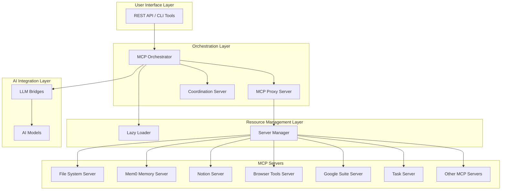

# MCP Ecosystem Documentation

> **📍 Model Context Protocol (MCP) Ecosystem**  
> A comprehensive ecosystem for building interoperable AI systems with standardized protocols, tools, and documentation.

## 📚 Table of Contents

- [Overview](#overview)
- [Architecture](#architecture)
- [Quick Start](#quick-start)
- [Core Components](#core-components)
- [API Documentation](#api-documentation)
- [Best Practices](#best-practices)
- [Troubleshooting](#troubleshooting)
- [Deployment](#deployment)
- [Contributing](#contributing)
- [Support](#support)

## 🎯 Overview

The MCP Ecosystem is a comprehensive platform for building interoperable AI systems with standardized protocols, tools, and documentation. The ecosystem is designed with a specification-driven approach that ensures consistency and maintainability across all components.

### Key Features

- **Specification-Driven Development**: All development aligns with a comprehensive specification document
- **Multi-Agent Coordination**: Unified LLM coordinator manages sessions and prevents conflicts
- **Todo Enforcement**: Mandatory todo tracking for all operations
- **Resource Optimization**: Lazy loading and memory management for efficient resource usage
- **Real MCP Integration**: Direct integration with actual MCP servers instead of simulation
- **Health Monitoring**: Real-time metrics and status reporting
- **Comprehensive Documentation**: Living documentation with automatic synchronization

### System Capabilities

- **MCP Server Management**: Dynamic loading and management of multiple MCP servers
- **Coordination & Enforcement**: Multi-agent coordination with branch switching protection
- **Resource Optimization**: Efficient memory usage with lazy loading and auto-cleanup
- **API Integration**: REST API for all ecosystem components
- **Real-time Monitoring**: Health checks and performance metrics
- **Git Workflow Integration**: Coordination-aware Git operations

## 🏗️ Architecture

The MCP Ecosystem follows a modular, service-oriented architecture:



### Core Architecture Components

1. **MCP Orchestrator**: Central hub managing communication between all components
2. **MCP Proxy Server**: Intelligent gateway routing requests to appropriate MCP servers
3. **Coordination Server**: Multi-agent coordination with todo enforcement
4. **Lazy Loader**: Resource-efficient server lifecycle management
5. **Unified LLM Coordinator**: Central authority for session management and todo tracking

For detailed architecture information, see [Architecture Documentation](docs/ARCHITECTURE.md).

## 🚀 Quick Start

### Prerequisites

- Node.js 18+ with npm 8+
- Git repository
- GitHub CLI (gh) for specification workflows
- Python 3.11+ for Spec-Kit (if using specification features)
- PM2 for process management

### Installation

1. **Clone and Setup**
```bash
git clone <repository-url>
cd mcp-ecosystem
npm install
```

2. **Initialize Configuration**
```bash
npm run docs:init
```

3. **Start the Ecosystem**
```bash
npm start
```

### Basic Usage

#### Check System Health
```bash
npm run docs:health
```

#### View Coordination Status
```bash
node tools/scripts/llm-coordinator-unified.js status
```

#### Execute an Operation
```bash
node tools/scripts/mcp-coordinator-bridge.js execute agent-id file-read --filePath ./README.md
```

#### Create a Todo
```bash
node tools/scripts/llm-coordinator-unified.js create dev-agent "Implement feature" --high
```

## 🔧 Core Components

### MCP Orchestrator

The orchestrator serves as the central hub for the entire ecosystem, managing communication between all components.

**Key Features:**
- Health check endpoints for all services
- Intelligent LLM selection based on availability
- Memory context management
- Coordination API proxy endpoints
- Real-time event streaming for multi-agent coordination

### MCP Proxy Server

The proxy server acts as an intelligent gateway between clients and individual MCP servers.

**Key Features:**
- Tool discovery and routing
- Lazy loading of servers on demand
- Tool call routing based on naming conventions
- Server lifecycle management

### Coordination Server

The coordination server provides multi-agent coordination and todo enforcement capabilities.

**Key Features:**
- Session management with conflict prevention
- Todo enforcement for all operations
- Branch switching protection
- Git operation validation
- Enforcement reporting

### Lazy Loader

The lazy loader manages the lifecycle of MCP servers, starting them on demand and stopping them when idle.

**Key Features:**
- On-demand server startup
- Automatic cleanup of idle servers
- Memory optimization for processes
- Configurable server configurations

### Unified LLM Coordinator

The unified coordinator serves as the central authority for both coordination and todo management.

**Key Features:**
- Centralized session management
- Todo enforcement for all operations
- Multi-agent coordination
- Persistent session state
- Real-time status monitoring

For detailed component information, see [Architecture Documentation](docs/ARCHITECTURE.md).

## 📡 API Documentation

The MCP Ecosystem provides a comprehensive REST API for interacting with all system components. The API follows RESTful principles and uses JSON for request and response bodies.

### Key Endpoints

- `GET /health` - Overall system health
- `GET /status` - Comprehensive status of all services
- `GET /tools` - List available proxy tools
- `POST /tool/:toolName` - Execute specific tools
- `POST /generate` - Generate responses with orchestration
- `GET /events` - Server-sent events for real-time coordination
- `GET /coordination/status` - Coordination service status
- `POST /coordination/check-branch` - Branch switching permission check

For complete API documentation, see [API Documentation](docs/API_DOCUMENTATION.md).

## 🎯 Best Practices

### Development Workflow

1. **Specification First**: Always start with a specification before implementation
2. **Todo Enforcement**: Create todos for all operations to maintain accountability
3. **Session Management**: Use coordinated sessions to prevent conflicts
4. **Resource Optimization**: Leverage lazy loading to minimize resource usage
5. **Health Monitoring**: Regularly check system status and address issues promptly

### Coordination Guidelines

- Use the unified coordinator for all operations
- Check coordination status before starting work
- Assign todos to prevent duplicate work
- Use coordination tools to prevent Git conflicts
- Monitor session status regularly

### Resource Management

- Start servers only when needed using lazy loading
- Set appropriate memory limits for each process
- Ensure idle servers are properly cleaned up
- Monitor resource usage and optimize as needed

For comprehensive best practices, see [Best Practices Guide](docs/BEST_PRACTICES.md).

## 🔧 Troubleshooting

### Common Issues

#### Service Not Starting
- Check if required ports are available
- Verify dependencies are installed
- Review configuration files and environment variables

#### Coordination Conflicts
- Complete or terminate active sessions before switching branches
- Create appropriate todos before performing operations
- Check coordination status before Git operations

#### Server Management Issues
- Ensure lazy loader is running
- Verify server configurations in lazy_loader.js
- Check port assignments and availability

### Diagnostic Commands

```bash
# Check overall health
curl http://localhost:3103/health

# Check coordination status
curl http://localhost:3109/api/status

# List running servers
curl http://localhost:3007/servers/status

# Check process status
pm2 list

# View logs
pm2 logs mcp-orchestrator
```

For detailed troubleshooting guidance, see [Troubleshooting Guide](docs/TROUBLESHOOTING.md).

## 🚢 Deployment

### PM2 Deployment (Recommended)

The ecosystem uses PM2 for process management with optimized resource usage:

```bash
# Start all services
npm start

# Stop all services
npm stop

# Restart all services
npm restart

# View process status
pm2 list

# Monitor resources
pm2 monit
```

### Docker Deployment

The ecosystem can be deployed using Docker containers:

```bash
# Build and start services
docker-compose up -d

# View logs
docker-compose logs -f

# Stop services
docker-compose down
```

### Configuration

The ecosystem can be configured through environment variables:

- `PORT`: Main port for the orchestrator (default: 3103)
- `LAZY_LOADER_URL`: URL for the lazy loader service (default: http://localhost:3007)
- `COORDINATION_URL`: URL for the coordination service (default: http://localhost:3109)
- `MEM0_URL`: URL for the Mem0 memory service (default: http://localhost:3100)

For complete deployment information, see [Deployment Guide](docs/MCP_ECOSYSTEM_DOCUMENTATION.md#deployment-guide).

## 🤝 Contributing

We welcome contributions to the MCP Ecosystem! Here's how you can help:

### Git Workflow

We follow a modified Git Flow branching model with semantic versioning. Please read our [Git Workflow Guide](docs/GIT_WORKFLOW.md) for complete details.

#### Branching Strategy

- **`main`**: Production-ready code only
- **`develop`**: Integration branch for features
- **`feature/*`**: Feature development (e.g., `feature/user-authentication`)
- **`bugfix/*`**: Bug fixes for non-critical issues
- **`hotfix/*`**: Critical fixes for production
- **`release/v*.*.*`**: Release preparation branches

#### Development Workflow

1. Sync with the latest `develop` branch:
   ```bash
   git checkout develop
   git pull origin develop
   ```

2. Create a feature branch:
   ```bash
   git checkout -b feature/amazing-feature
   # or use the alias: git create-feature amazing-feature
   ```

3. Make your changes following coding standards

4. Run checks before committing:
   ```bash
   npm run docs:check
   npm run test
   ```

5. Commit your changes with a conventional commit message:
   ```bash
   git add .
   git commit -m "feat(auth): add OAuth2 callback + state validation"
   ```

6. Push to your branch:
   ```bash
   git push origin feature/amazing-feature
   ```

7. Open a Pull Request using our [template](.github/pull_request_template.md)

### Commit Message Guidelines

We follow [Conventional Commits](https://www.conventionalcommits.org/) specification. Please read our [Conventional Commits Guide](docs/CONVENTIONAL_COMMITS.md) for complete details.

#### Types

- `feat`: A new feature
- `fix`: A bug fix
- `docs`: Documentation only changes
- `style`: Changes that do not affect the meaning of the code
- `refactor`: A code change that neither fixes a bug nor adds a feature
- `perf`: A code change that improves performance
- `test`: Adding missing tests or correcting existing tests
- `build`: Changes that affect the build system or external dependencies
- `ci`: Changes to CI configuration files and scripts
- `chore`: Other changes that don't modify src or test files
- `revert`: Reverts a previous commit
- `mcp`: MCP protocol related changes
- `coordination`: Coordination system changes
- `orchestration`: Orchestration system changes
- `spec`: Specification related changes

### Code Standards

- Follow the existing code style and patterns
- Write comprehensive tests for new features
- Update documentation for any changes
- Ensure all tests pass before submitting
- Use ESLint and Prettier for code formatting (automatically applied via pre-commit hook)
- Write clear, descriptive commit messages following conventional commits

### Issue Reporting

When reporting issues, please include:
- Clear description of the problem
- Steps to reproduce the issue
- Expected vs actual behavior
- Environment information (OS, Node.js version, etc.)
- Relevant log output or error messages

## 🆘 Support

### Documentation
- [Main Documentation](docs/MCP_ECOSYSTEM_DOCUMENTATION.md)
- [Architecture](docs/ARCHITECTURE.md)
- [API Documentation](docs/API_DOCUMENTATION.md)
- [Best Practices](docs/BEST_PRACTICES.md)
- [Troubleshooting](docs/TROUBLESHOOTING.md)

### Community Support
- **Issues**: [GitHub Issues](https://github.com/lorenzorasmussen/mcp-ecosystem/issues) - Report bugs and request features
- **Discussions**: [GitHub Discussions](https://github.com/lorenzorasmussen/mcp-ecosystem/discussions) - Ask questions and share knowledge
- **Pull Requests**: Contribute fixes and improvements

### Diagnostic Tools
```bash
# Run comprehensive health check
npm run docs:health

# Validate specifications
npm run docs:validate

# Run complete system check
npm run docs:check

# Run coverage analysis
npm run coverage:check
```

## 📄 License

This project is licensed under the MIT License - see the [LICENSE](LICENSE) file for details.

## 🙏 Acknowledgments

- The Model Context Protocol community for the foundational MCP specification
- The open-source community for the various libraries and tools used in this ecosystem
- Contributors and users who help improve the system through feedback and contributions

---

**Built with ❤️ by the MCP Documentation Team**

For the most up-to-date information, visit our [GitHub repository](https://github.com/lorenzorasmussen/mcp-ecosystem).