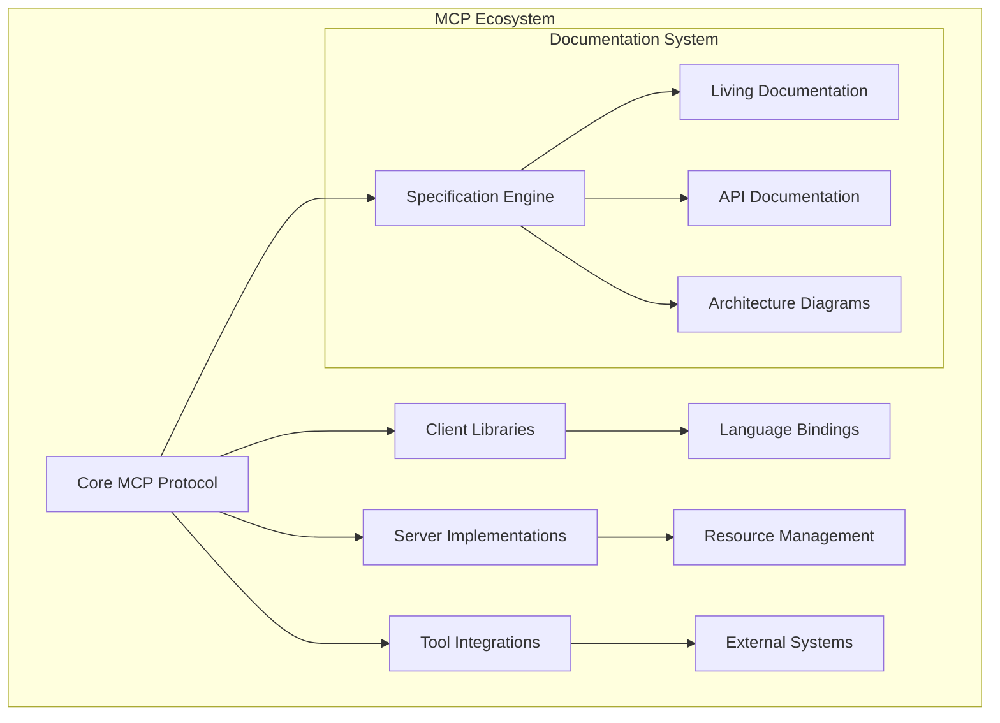

# MCP Ecosystem Specification

> **📍 Authoritative Source of Truth**  
> This specification and its associated documents constitute the single source of truth for the MCP (Model Context Protocol) ecosystem. All implementation decisions, architectural choices, and feature development must align with this specification.

---

## 🎯 Purpose & Scope

This specification defines the complete architecture, requirements, and implementation guidelines for the MCP ecosystem. It serves as the authoritative reference for:

- **System Architecture** - Overall design and component relationships
- **API Contracts** - Interface definitions and data models
- **Development Standards** - Coding practices and quality requirements
- **Documentation Requirements** - Living documentation standards
- **Governance Processes** - Decision-making and change management

---

## 📋 Specification Structure

### Core Documents

| Document                                            | Purpose                                   | Status         |
| --------------------------------------------------- | ----------------------------------------- | -------------- |
| **[Constitution](SPECIFICATION/constitution.md)**   | Foundational principles and governance    | ✅ Active      |
| **[Architecture](docs/architecture/README.md)**     | System design and component relationships | 🔄 In Progress |
| **[API Reference](docs/api/README.md)**             | Complete API documentation and contracts  | 🔄 In Progress |
| **[Development Guide](docs/development/README.md)** | Development standards and workflows       | ✅ Active      |

### Templates & Standards

| Template           | Usage                     | Location                                    |
| ------------------ | ------------------------- | ------------------------------------------- |
| **Spec Template**  | Feature specifications    | `SPECIFICATION/templates/spec-template.md`  |
| **Plan Template**  | Implementation plans      | `SPECIFICATION/templates/plan-template.md`  |
| **Tasks Template** | Work breakdown structures | `SPECIFICATION/templates/tasks-template.md` |

---

## 🔄 Specification Lifecycle

### 4-Phase Development Process

All features and changes must follow the Spec-Kit 4-phase process:

#### 1. SPECIFY Phase

- **Objective**: Define what & why
- **Activities**: Requirements gathering, user story creation, success metrics
- **Deliverable**: Approved feature specification
- **Gate**: Stakeholder approval and architectural review

#### 2. PLAN Phase

- **Objective**: Define how
- **Activities**: Architecture design, technology selection, dependency analysis
- **Deliverable**: Detailed implementation plan
- **Gate**: Technical review and resource allocation

#### 3. TASKS Phase

- **Objective**: Break into actionable work
- **Activities**: Task breakdown, estimation, sequencing
- **Deliverable**: Prioritized task backlog
- **Gate**: Sprint planning and assignment

#### 4. IMPLEMENT Phase

- **Objective**: Build to spec
- **Activities**: Coding, testing, documentation updates
- **Deliverable**: Working feature with complete documentation
- **Gate**: Quality assurance and spec compliance validation

---

## 📊 Compliance & Validation

### Automated Validation

All changes are automatically validated for:

- **Specification Alignment** - Code matches approved specifications
- **Documentation Completeness** - All changes are documented
- **Quality Standards** - Code quality and testing requirements
- **Architecture Compliance** - Adherence to established patterns

### Manual Review Process

1. **Specification Review** - Requirements and design validation
2. **Architecture Review** - System design and integration impact
3. **Code Review** - Implementation quality and standards compliance
4. **Documentation Review** - Accuracy and completeness validation

---

## 🏗️ Architecture Overview

### System Components

### Key Principles

1. **Protocol First** - All implementations follow the core MCP protocol
2. **Extensibility** - Plugin architecture for tool and resource integration
3. **Interoperability** - Cross-language compatibility and standardization
4. **Documentation Driven** - Specifications precede and guide implementation

---

## 📚 Development Standards

### Code Quality Requirements

- **Test Coverage**: Minimum 90% for new code
- **Documentation**: All public APIs must be documented
- **Style Guidelines**: Language-specific formatting standards
- **Security**: Security review for all protocol changes

### Documentation Standards

- **Living Documentation**: Automatically synchronized with code
- **Example Testing**: All code examples must be executable
- **Accessibility**: WCAG 2.1 AA compliance for all documentation
- **Version Control**: All documentation in version control

---

## 🔧 Tooling & Automation

### Spec-Kit Integration

- **GitHub Integration**: Specification management through GitHub
- **AI Assistance**: Automated spec generation and validation
- **Drift Detection**: Real-time code-specification alignment monitoring
- **Dashboard**: Comprehensive specification health metrics

### CI/CD Pipeline

- **Specification Validation**: Automated compliance checking
- **Documentation Generation**: API docs from code annotations
- **Quality Gates**: Automated testing and code quality checks
- **Deployment**: Automated release and documentation publishing

---

## 📋 Governance

### Roles & Responsibilities

| Role                          | Responsibilities                  | Authority                            |
| ----------------------------- | --------------------------------- | ------------------------------------ |
| **Specification Owner**       | Maintains specification integrity | Final approval on spec changes       |
| **Architecture Review Board** | System design validation          | Architecture compliance decisions    |
| **Implementation Teams**      | Feature development               | Implementation decisions within spec |
| **Documentation Architects**  | Documentation standards           | Documentation quality requirements   |

### Change Management

1. **Proposal**: Specification change proposal with justification
2. **Review**: Community and architectural review
3. **Approval**: Specification owner approval
4. **Implementation**: Update to specification and related documents
5. **Communication**: Change notification and impact assessment

---

## 🎯 Success Metrics

### Specification Quality

- **Coverage**: Percentage of system covered by specifications
- **Accuracy**: Alignment between specifications and implementation
- **Completeness**: All aspects adequately specified
- **Clarity**: Specification understandability and unambiguity

### Development Efficiency

- **Time-to-Spec**: Time from concept to approved specification
- **Implementation Velocity**: Speed of development from spec to release
- **Rework Rate**: Percentage of work requiring revision
- **Quality Metrics**: Defect rates and customer satisfaction

---

## 📞 Support & Contribution

### Getting Help

- **Documentation**: [Complete documentation library](docs/)
- **Issues**: [GitHub Issues](https://github.com/lorenzorasmussen/mcp-ecosystem/issues)
- **Discussions**: [GitHub Discussions](https://github.com/lorenzorasmussen/mcp-ecosystem/discussions)
- **Community**: [Discord Server](https://discord.gg/mcp)

### Contributing

1. **Read**: Study this specification and related documents
2. **Propose**: Submit specification change proposals
3. **Implement**: Develop according to approved specifications
4. **Document**: Update documentation to reflect changes
5. **Review**: Participate in community review process

---

## 📈 Roadmap & Evolution

### Current Focus Areas

- **Protocol Standardization**: Core protocol refinement and stabilization
- **Tool Ecosystem**: Expansion of tool integrations and libraries
- **Documentation Automation**: Enhanced living documentation capabilities
- **Performance Optimization**: Scalability and efficiency improvements

### Future Directions

- **Advanced AI Integration**: Enhanced AI-powered specification tools
- **Cross-Platform Support**: Expanded platform and language support
- **Enterprise Features**: Advanced security and governance capabilities
- **Community Growth**: Expanded contributor ecosystem and governance

---

## 📄 License & Usage

This specification is licensed under the [MIT License](LICENSE) and is freely available for:

- **Implementation**: Building MCP-compliant systems
- **Extension**: Creating compatible tools and integrations
- **Reference**: Architectural guidance and best practices
- **Contribution**: Community-driven evolution and improvement

---

**Specification Version**: 1.0.0  
**Last Updated**: 2025-10-29  
**Next Review**: 2025-11-29  
**Maintainer**: MCP Ecosystem Team

---

> **🎯 This specification is the single source of truth for the MCP ecosystem. All development decisions must align with these standards and requirements.**
