# MCP Ecosystem Architecture

## System Architecture Overview

The MCP Ecosystem is built with a modular, service-oriented architecture that emphasizes coordination, resource efficiency, and real-world MCP integration. The system follows a layered approach with clear separation of concerns.

### High-Level Architecture

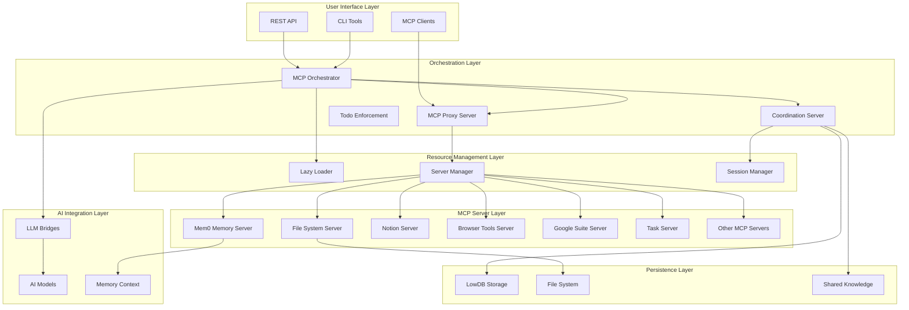

## Core Component Architecture

### 1. MCP Orchestrator

The orchestrator is the central hub that manages communication between all components of the ecosystem. It provides a unified interface for accessing different services and manages the overall system state.

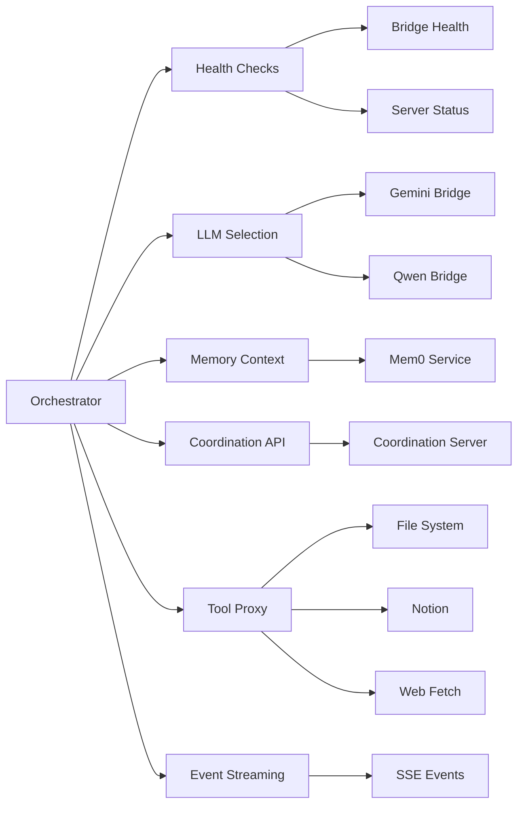

### 2. MCP Proxy Server

The proxy server acts as an intelligent gateway that routes requests to appropriate MCP servers based on tool requirements and availability.

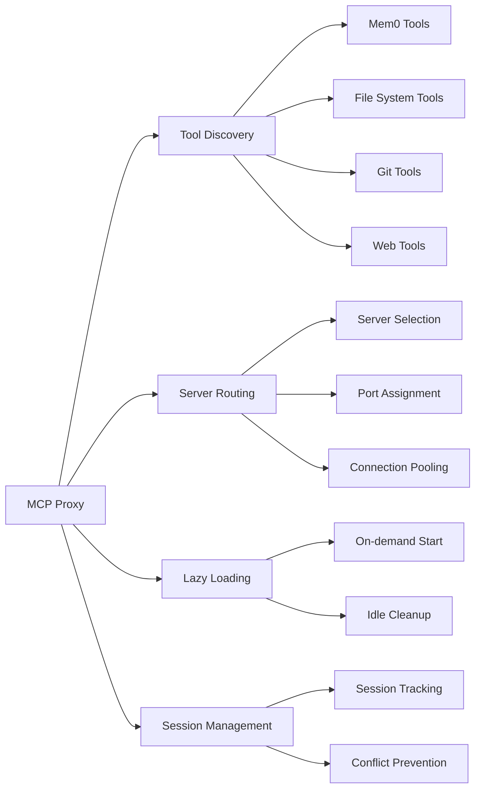

### 3. Coordination Server

The coordination server provides multi-agent coordination capabilities with todo enforcement to ensure organized development workflows.

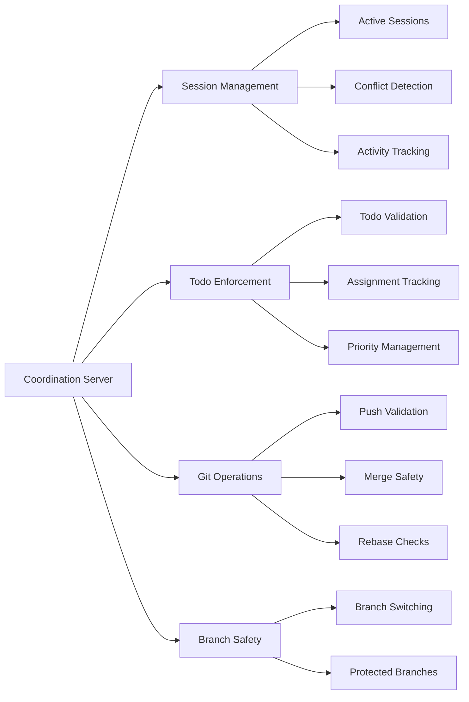

### 4. Lazy Loader

The lazy loader manages the lifecycle of MCP servers, optimizing resource usage by starting servers on demand and stopping them when idle.

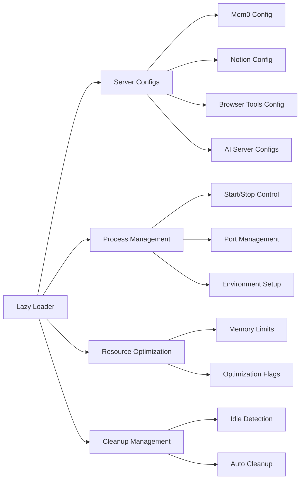

## Deployment Architecture

### Docker Compose Deployment

The ecosystem can be deployed using Docker containers with shared volumes for efficient resource usage:

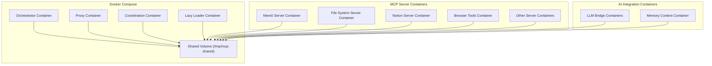

### PM2 Process Management

For non-containerized deployments, PM2 manages the processes with resource optimization:

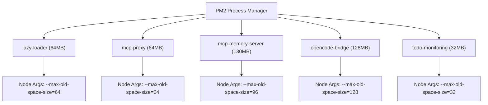

## Data Flow Architecture

### Request Processing Flow

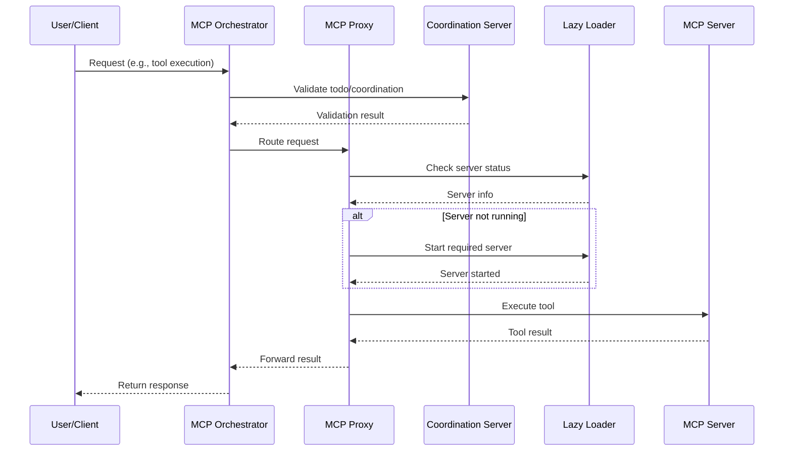

### Coordination Flow

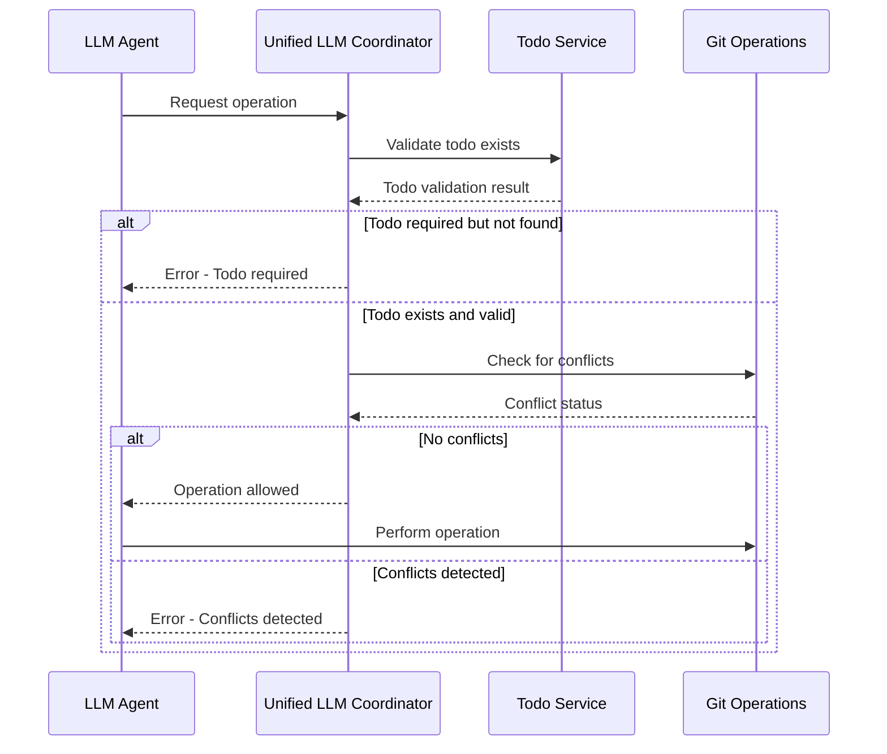

## Resource Optimization Architecture

### Memory Management

The ecosystem implements several optimization strategies to minimize resource usage:

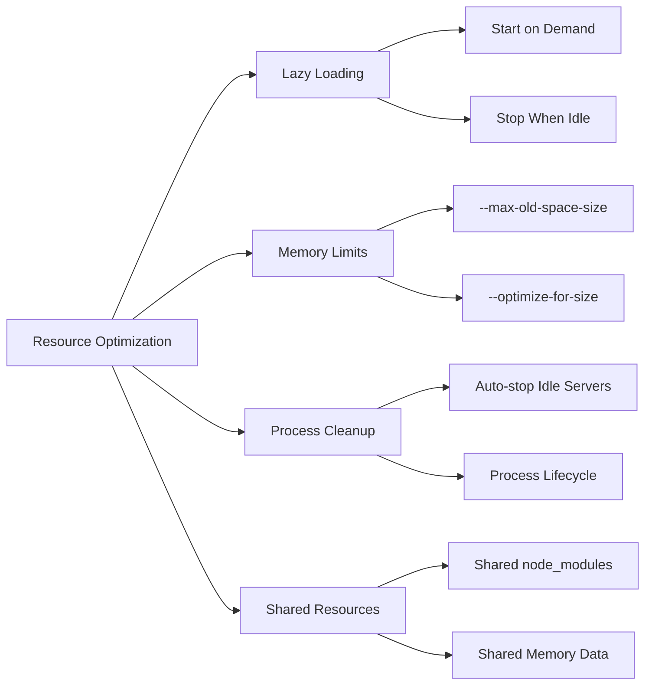

## Security Architecture

### Enforcement System

The ecosystem includes a comprehensive enforcement system to prevent conflicts and ensure accountability:

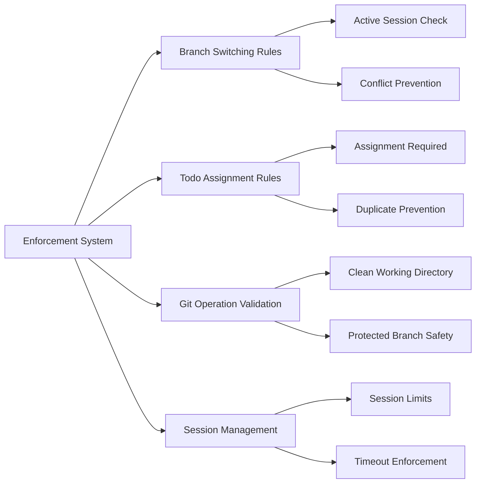

## Monitoring and Observability

### Health Monitoring Architecture

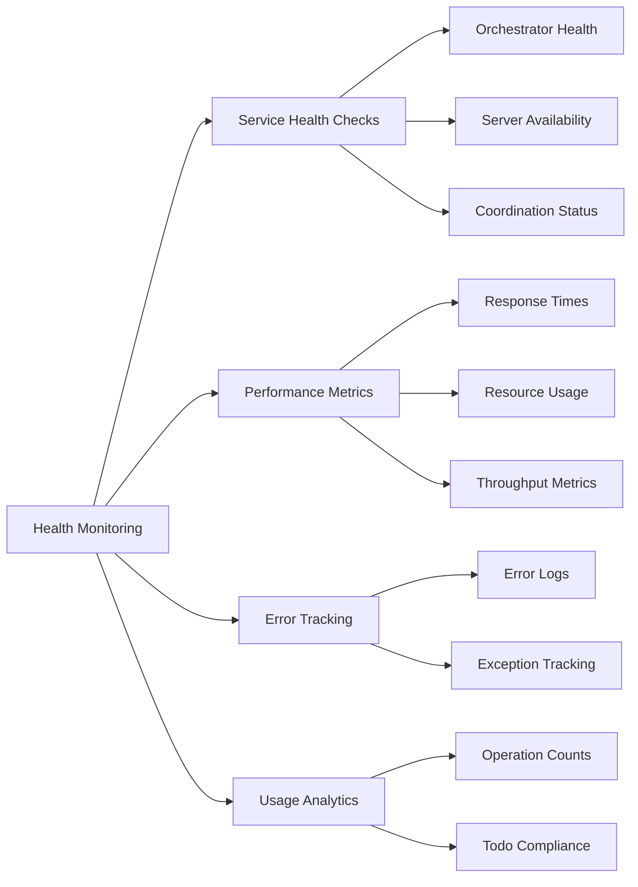

This architecture ensures that the MCP Ecosystem is scalable, maintainable, and efficient while providing comprehensive coordination and enforcement capabilities for multi-agent AI development workflows.