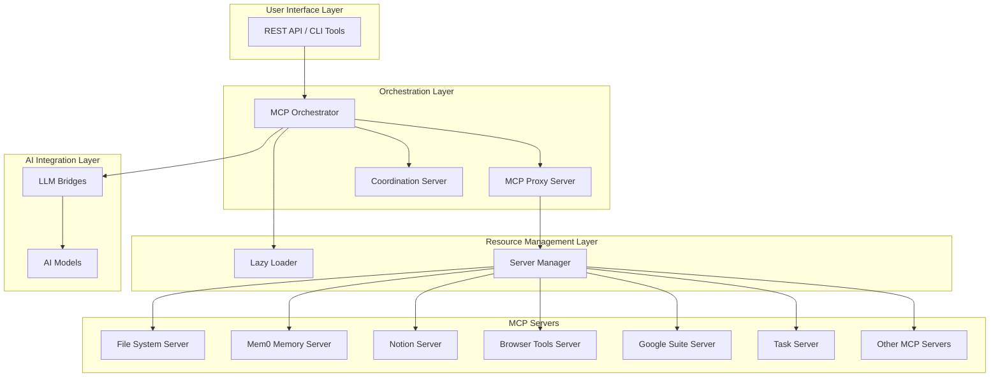

# MCP Ecosystem Documentation

## Table of Contents
- [Overview](#overview)
- [Architecture](#architecture)
- [Core Components](#core-components)
- [Deployment Guide](#deployment-guide)
- [API Documentation](#api-documentation)
- [Best Practices](#best-practices)
- [Troubleshooting](#troubleshooting)

## Overview

The MCP (Model Context Protocol) Ecosystem is a comprehensive platform for building interoperable AI systems with standardized protocols, tools, and documentation. The ecosystem is designed with a specification-driven approach that ensures consistency and maintainability across all components.

### Key Features
- **Specification-Driven Development**: All development aligns with a comprehensive specification document
- **Multi-Agent Coordination**: Unified LLM coordinator manages sessions and prevents conflicts
- **Todo Enforcement**: Mandatory todo tracking for all operations
- **Resource Optimization**: Lazy loading and memory management for efficient resource usage
- **Real MCP Integration**: Direct integration with actual MCP servers instead of simulation
- **Health Monitoring**: Real-time metrics and status reporting

## Architecture

The MCP Ecosystem follows a modular architecture with several key components:



### Architecture Components

1. **User Interface Layer**: Provides REST API endpoints and CLI tools for interacting with the ecosystem
2. **Orchestration Layer**: Central coordination and routing of requests
3. **Resource Management Layer**: Efficient resource allocation and lazy loading
4. **MCP Servers**: Individual server implementations for different capabilities
5. **AI Integration Layer**: LLM bridges and AI model integration

## Core Components

### MCP Orchestrator
The orchestrator serves as the central hub for the entire ecosystem, managing communication between all components.

**Key Features:**
- Health check endpoints for all services
- Intelligent LLM selection based on availability
- Memory context management
- Coordination API proxy endpoints
- Real-time event streaming for multi-agent coordination

**Endpoints:**
- `GET /health` - Overall system health
- `GET /coordination/health` - Coordination service health
- `GET /status` - Comprehensive status of all services
- `GET /tools` - List available proxy tools
- `POST /tool/:toolName` - Execute specific tools
- `POST /generate` - Generate responses with orchestration
- `GET /events` - Server-sent events for real-time coordination

### MCP Proxy Server
The proxy server acts as an intelligent gateway between clients and individual MCP servers.

**Key Features:**
- Tool discovery and routing
- Lazy loading of servers on demand
- Tool call routing based on naming conventions
- Server lifecycle management

### Coordination Server
The coordination server provides multi-agent coordination and todo enforcement capabilities.

**Key Features:**
- Session management with conflict prevention
- Todo enforcement for all operations
- Branch switching protection
- Git operation validation
- Enforcement reporting

**Endpoints:**
- `GET /health` - Service health check
- `GET /api/status` - Comprehensive coordination status
- `POST /api/enforcement/check-branch` - Branch switching permission check
- `POST /api/enforcement/check-git` - Git operation permission check
- `POST /api/enforcement/check-todo` - Todo operation permission check
- `GET /api/enforcement/report` - Enforcement report generation

### Lazy Loader
The lazy loader manages the lifecycle of MCP servers, starting them on demand and stopping them when idle.

**Key Features:**
- On-demand server startup
- Automatic cleanup of idle servers
- Memory optimization for processes
- Configurable server configurations

### Unified LLM Coordinator
The unified coordinator serves as the central authority for both coordination and todo management.

**Key Features:**
- Centralized session management
- Todo enforcement for all operations
- Multi-agent coordination
- Persistent session state
- Real-time status monitoring

## Deployment Guide

### Prerequisites

- Node.js 18+ with npm 8+
- Git repository
- GitHub CLI (gh) for specification workflows
- Python 3.11+ for Spec-Kit (if using specification features)
- PM2 for process management

### Installation

1. **Clone and Setup**
```bash
git clone <repository-url>
cd mcp-ecosystem
npm install
```

2. **Initialize Configuration**
```bash
npm run docs:init
```

3. **Install Git Hooks (Optional)**
```bash
npm run docs:setup-hooks
```

### Configuration

The ecosystem can be configured through environment variables and configuration files:

#### Environment Variables
- `PORT`: Main port for the orchestrator (default: 3103)
- `LAZY_LOADER_URL`: URL for the lazy loader service (default: http://localhost:3007)
- `COORDINATION_URL`: URL for the coordination service (default: http://localhost:3109)
- `MEM0_URL`: URL for the Mem0 memory service (default: http://localhost:3100)
- `FILESYSTEM_URL`: URL for the filesystem service (default: http://localhost:3104)
- `NOTION_URL`: URL for the Notion service (default: http://localhost:3105)
- `WEBFETCH_URL`: URL for the web fetch service (default: http://localhost:3106)
- `BROWSERTOOLS_URL`: URL for the browser tools service (default: http://localhost:3107)
- `DESKTOP_CONTROL_URL`: URL for the desktop control service (default: http://localhost:3108)

#### Server Configuration
Server configurations are defined in the lazy loader implementation with options for:
- Memory limits
- Startup arguments
- Port assignments
- Environment variables

### Starting the Ecosystem

#### Using PM2 (Recommended)
```bash
# Start all services
npm start

# Stop all services
npm stop

# Restart all services
npm restart
```

#### Manual Start
```bash
# Start lazy loader
node src/mcp-ecosystem/core/lazy_loader.js

# Start MCP proxy
node src/mcp-ecosystem/core/mcp_proxy.js

# Start orchestrator
node src/mcp-ecosystem/core/orchestrator.js

# Start coordination server
node src/mcp-ecosystem/servers/coordination-server.js
```

### Docker Deployment

The ecosystem can be deployed using Docker containers:

1. **Build Images**
```bash
docker-compose build
```

2. **Start Services**
```bash
docker-compose up -d
```

3. **View Logs**
```bash
docker-compose logs -f
```

## API Documentation

### MCP Orchestrator API

#### Health and Status Endpoints

**GET /health**
- Description: Check overall system health
- Response:
```json
{
  "status": "healthy",
  "service": "orchestrator"
}
```

**GET /status**
- Description: Get comprehensive status of all services
- Response:
```json
{
  "mcp-gemini-bridge": {
    "overall": true,
    "http": true,
    "ws": true
  },
  "mcp-qwen-bridge": {
    "overall": false,
    "http": false,
    "ws": false
  },
  "coordination": {
    "status": "healthy",
    "integrated": true
  }
}
```

#### Tool Execution Endpoints

**GET /tools**
- Description: List available proxy tools
- Response:
```json
{
  "tools": [
    "filesystem",
    "notion",
    "webfetch",
    "browsertools",
    "desktop-control",
    "memory",
    "coordination"
  ]
}
```

**POST /tool/:toolName**
- Description: Execute a specific tool
- Request Body:
```json
{
  "method": "query",
  "parameters": {}
}
```
- Response:
```json
{
  "result": "tool execution result"
}
```

#### Generation Endpoints

**POST /generate**
- Description: Generate response with orchestration
- Request Body:
```json
{
  "prompt": "Your prompt here",
  "sessionId": "session-id",
  "context": {}
}
```
- Response:
```json
{
  "response": "Generated response",
  "model": "model-name",
  "llm": "selected-llm"
}
```

### Coordination Server API

#### Health and Status Endpoints

**GET /health**
- Description: Check coordination server health
- Response:
```json
{
  "status": "healthy",
  "service": "mcp-coordination-server",
  "version": "1.0.0",
  "uptime": 3600.5,
  "timestamp": "2023-10-29T12:34:56.789Z"
}
```

**GET /api/status**
- Description: Get comprehensive coordination status
- Response:
```json
{
  "success": true,
  "data": {
    "sessions": {
      "total": 5,
      "active": 3,
      "branches": 4
    },
    "todos": {
      "total": 17,
      "active": 10,
      "completed": 3,
      "agents": 11
    },
    "enforcement": {
      "rules_loaded": true,
      "hooks_installed": true,
      "violations": 0
    }
  }
}
```

#### Enforcement Endpoints

**POST /api/enforcement/check-branch**
- Description: Check if branch switching is allowed
- Request Body:
```json
{
  "branch": "feature/new-feature",
  "force": false
}
```
- Response:
```json
{
  "success": true,
  "allowed": true,
  "reason": "No conflicts detected",
  "conflicts": [],
  "branch": "feature/new-feature",
  "force": false
}
```

**POST /api/enforcement/check-todo**
- Description: Check if todo operation is allowed
- Request Body:
```json
{
  "operation": "start",
  "todoId": "todo-123",
  "agentId": "agent-1",
  "options": {}
}
```
- Response:
```json
{
  "success": true,
  "allowed": true,
  "reason": "Operation allowed",
  "operation": "start",
  "todoId": "todo-123",
  "agentId": "agent-1"
}
```

### MCP Proxy Server API

#### Tool Discovery

**GET /tools**
- Description: List all available tools
- Response:
```json
{
  "tools": [
    {
      "name": "mem0_store_memory",
      "description": "Store a memory item for a session",
      "inputSchema": {
        "type": "object",
        "properties": {
          "sessionId": {
            "type": "string",
            "description": "Session identifier"
          },
          "content": {
            "type": "string",
            "description": "Memory content to store"
          }
        }
      }
    }
  ]
}
```

## Best Practices

### Development Workflow

1. **Specification First**: Always start with a specification before implementation
2. **Todo Enforcement**: Create todos for all operations to maintain accountability
3. **Session Management**: Use coordinated sessions to prevent conflicts
4. **Resource Optimization**: Leverage lazy loading to minimize resource usage
5. **Health Monitoring**: Regularly check system status and address issues promptly

### Code Quality

1. **Documentation**: Maintain up-to-date documentation for all components
2. **Testing**: Implement comprehensive tests for new features
3. **Error Handling**: Implement proper error handling and logging
4. **Security**: Validate all inputs and sanitize outputs
5. **Performance**: Optimize for memory usage and response times

### Coordination Guidelines

1. **Session Awareness**: Always check for active sessions before starting work
2. **Todo Assignment**: Assign todos to prevent duplicate work
3. **Branch Safety**: Use coordination tools to prevent branch conflicts
4. **Communication**: Use the todo system to communicate work status
5. **Monitoring**: Regularly check coordination status and compliance

### Resource Management

1. **Lazy Loading**: Start servers only when needed
2. **Memory Limits**: Set appropriate memory limits for each process
3. **Cleanup**: Ensure idle servers are properly cleaned up
4. **Monitoring**: Track resource usage and optimize as needed
5. **Scaling**: Plan for horizontal scaling when needed

## Troubleshooting

### Common Issues

#### Server Startup Issues
**Problem**: MCP servers fail to start
**Solution**: Check if the lazy loader is running and accessible. Verify port availability and memory limits.

#### Coordination Conflicts
**Problem**: Branch switching is blocked due to active sessions
**Solution**: Complete or terminate active sessions before switching branches, or use the --force flag if necessary.

#### Todo Enforcement Errors
**Problem**: Operations are blocked due to missing todos
**Solution**: Create appropriate todos before performing operations, or adjust enforcement settings if needed.

#### Memory Issues
**Problem**: High memory usage
**Solution**: Check lazy loader configuration and ensure proper cleanup of idle servers.

#### API Connection Issues
**Problem**: Unable to connect to API endpoints
**Solution**: Verify service URLs and port configurations in environment variables.

### Diagnostic Commands

**Check Overall Health**
```bash
curl http://localhost:3103/health
```

**Check Coordination Status**
```bash
curl http://localhost:3109/api/status
```

**List Available Tools**
```bash
curl http://localhost:3103/tools
```

**Check Running Servers**
```bash
curl http://localhost:3007/servers/status
```

### Logging and Monitoring

The ecosystem provides comprehensive logging through Winston-based logging system with both file and console outputs. Log files are stored in the `logs/` directory with rotation configured for optimal performance.

For monitoring, the system provides:
- Health check endpoints for each service
- Real-time status reporting
- Performance metrics
- Error tracking and reporting

### Support Resources

- **Issue Tracker**: Use GitHub Issues for bug reports and feature requests
- **Documentation**: Refer to the comprehensive documentation in the docs/ directory
- **Examples**: Check the examples/ directory for usage examples
- **Community**: Join the GitHub Discussions for community support

## Conclusion

The MCP Ecosystem provides a comprehensive platform for building interoperable AI systems with standardized protocols. The architecture is designed for scalability, maintainability, and efficient resource usage while providing robust coordination and enforcement mechanisms.

The ecosystem continues to evolve with new features and improvements based on real-world usage and feedback. For the latest updates and enhancements, check the project's GitHub repository.