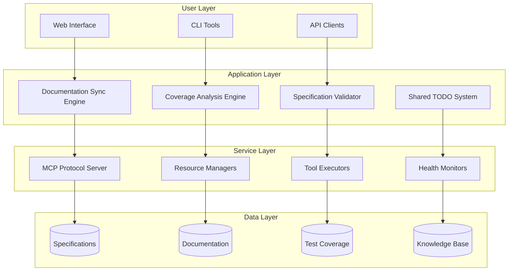
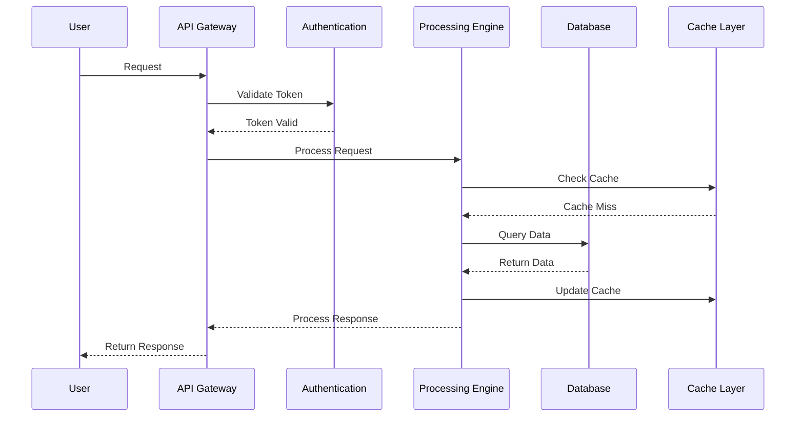
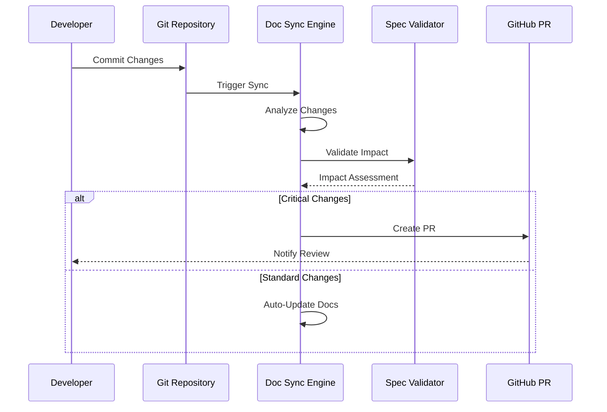
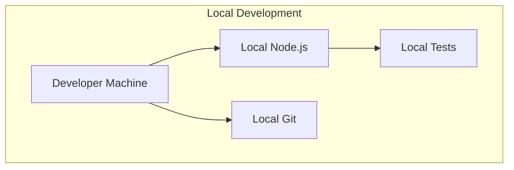
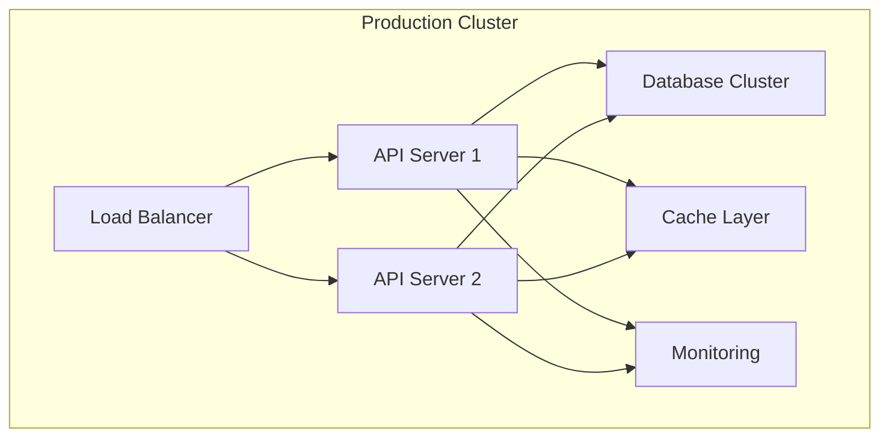
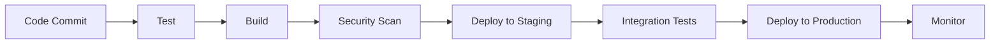

# Architecture Documentation

## 🏗️ System Architecture Overview

The MCP (Model Context Protocol) Ecosystem is built on a modular, specification-driven architecture that ensures interoperability, scalability, and maintainability across different platforms and use cases.

## 📋 Architectural Principles

### 1. Specification-Driven Development

- **Single Source of Truth**: All decisions trace back to the [SPECIFICATION.md](../../SPECIFICATION.md)
- **4-Phase Workflow**: Specify → Plan → Tasks → Implement
- **Automated Validation**: Continuous compliance checking against specifications

### 2. Modular Component Design

- **Loose Coupling**: Components communicate through well-defined interfaces
- **High Cohesion**: Related functionality grouped within components
- **Plugin Architecture**: Extensible through standardized plugin interfaces

### 3. Protocol-First Approach

- **MCP Protocol**: Standardized communication between AI models and tools
- **Interoperability**: Cross-platform and cross-language compatibility
- **Version Management**: Backward-compatible protocol evolution

## 🏛️ Core Architecture Components

### System Layers



### Component Descriptions

#### Documentation Sync Engine

**Purpose**: Automatically synchronize documentation with code changes
**Key Features**:

- Real-time change detection
- Impact classification (critical/standard/minor)
- Automated PR creation for critical changes
- Drift detection and reporting

#### Coverage Analysis Engine

**Purpose**: Comprehensive test coverage analysis and improvement
**Key Features**:

- Multi-language coverage support
- Automated test generation
- CI/CD integration
- Coverage threshold enforcement

#### Specification Validator

**Purpose**: Ensure compliance with architectural specifications
**Key Features**:

- Automated validation against templates
- Completeness checking
- Consistency verification
- Governance reporting

#### Shared TODO System

**Purpose**: Collaborative task management across teams
**Key Features**:

- Real-time synchronization
- Priority-based task management
- Integration with development workflows
- Progress tracking and reporting

## 🔄 Data Flow Architecture

### Request Processing Flow



### Documentation Sync Flow



## 🗂️ Directory Structure

```
mcp-ecosystem/
├── 📋 SPECIFICATION.md          # Authoritative requirements
├── 📖 README.md                 # Project overview
├── 📦 package.json              # Dependencies and scripts
├── ⚙️ ecosystem.config.cjs       # PM2 process management
│
├── 📋 SPECIFICATION/            # Specification system
│   ├── constitution.md          # Governance principles
│   └── templates/              # Standardized templates
│
├── 💻 src/                     # Source code
│   ├── client/                 # MCP client implementations
│   ├── mcp-ecosystem/         # Core ecosystem components
│   └── shared/                 # Shared utilities
│
├── 📚 docs/                    # Documentation
│   ├── development/            # Development guides
│   ├── api/                   # API documentation
│   ├── architecture/          # Architecture docs (this)
│   └── examples/              # Code examples
│
├── 🛠️ tools/                   # Development tools
│   ├── scripts/               # Automation scripts
│   ├── monitoring/            # System monitoring
│   └── setup/                 # Setup utilities
│
├── 🧪 tests/                   # Test suites
├── ⚙️ config/                  # Configuration files
├── 💾 data/                    # Data storage
├── 📦 vendor/                  # Third-party dependencies
├── 📋 specs/                   # Feature specifications
├── 🐙 .github/                # GitHub automation
└── 🔧 scripts/                 # Utility scripts
```

## 🔧 Technology Stack

### Core Technologies

| Component              | Technology              | Purpose                                  |
| ---------------------- | ----------------------- | ---------------------------------------- |
| **Runtime**            | Node.js 18+             | Server-side JavaScript execution         |
| **Process Management** | PM2                     | Production process orchestration         |
| **Protocol**           | MCP Protocol            | Standardized AI-tool communication       |
| **Documentation**      | Markdown + Custom Tools | Living documentation system              |
| **Version Control**    | Git + GitHub            | Source code and documentation management |
| **CI/CD**              | GitHub Actions          | Automated testing and deployment         |

### Supporting Technologies

| Category          | Technologies           | Purpose                                 |
| ----------------- | ---------------------- | --------------------------------------- |
| **Testing**       | Jest, Coverage Tools   | Quality assurance and coverage analysis |
| **Linting**       | ESLint, Prettier       | Code quality and formatting             |
| **Documentation** | Custom Sync Engine     | Automated documentation management      |
| **Monitoring**    | Health Checks, Metrics | System observability                    |
| **Security**      | Input Validation, Auth | Secure API access                       |

## 🚀 Deployment Architecture

### Development Environment



### Production Environment



### CI/CD Pipeline



## 📊 Performance Characteristics

### Scalability Metrics

- **Concurrent Users**: Designed for 10,000+ concurrent users
- **API Response Time**: <100ms for standard requests
- **Documentation Sync**: <30 seconds for typical changes
- **Coverage Analysis**: <5 minutes for full codebase analysis

### Reliability Targets

- **Uptime**: 99.9% service availability
- **Data Durability**: 99.999% data persistence
- **Error Rate**: <0.1% request failure rate
- **Recovery Time**: <5 minutes for service restoration

## 🔒 Security Architecture

### Authentication & Authorization

- **API Keys**: For programmatic access
- **OAuth2**: For user-based authentication
- **JWT Tokens**: For session management
- **Role-Based Access**: Granular permission control

### Data Protection

- **Encryption**: TLS 1.3 for data in transit
- **Storage Encryption**: Encrypted data at rest
- **Input Validation**: Comprehensive input sanitization
- **Audit Logging**: Complete activity tracking

## 🔄 Evolution & Extensibility

### Plugin Architecture

The system supports extensibility through standardized plugin interfaces:

```typescript
interface MCPPlugin {
  name: string;
  version: string;
  capabilities: string[];
  initialize(config: PluginConfig): Promise<void>;
  execute(operation: string, params: any): Promise<any>;
}
```

### Protocol Extensions

The MCP protocol can be extended through:

- **Tool Registration**: New tools can be added dynamically
- **Resource Types**: Custom resource types supported
- **Authentication Methods**: Pluggable authentication providers
- **Transport Protocols**: Alternative communication channels

## 📈 Monitoring & Observability

### Key Metrics

- **System Health**: CPU, memory, disk usage
- **API Performance**: Response times, error rates
- **Documentation Quality**: Coverage, freshness, drift
- **User Activity**: Usage patterns, feature adoption

### Logging Strategy

- **Structured Logging**: JSON-formatted logs for analysis
- **Log Levels**: ERROR, WARN, INFO, DEBUG
- **Centralized Collection**: Aggregated log analysis
- **Retention Policy**: 90-day log retention

## 🎯 Future Architecture Directions

### Planned Enhancements

1. **Microservices Migration**: Decompose monolithic components
2. **Event-Driven Architecture**: Async processing for better scalability
3. **Multi-Region Deployment**: Global distribution for performance
4. **AI-Powered Features**: Machine learning for optimization

### Research Areas

- **Edge Computing**: Distributed processing capabilities
- **WebAssembly**: Cross-platform binary execution
- **Blockchain Integration**: Decentralized trust and verification
- **Quantum Computing**: Future-proof cryptographic algorithms

---

**Architecture Version**: 1.0.0
**Last Updated**: 2025-10-29
**Review Date**: 2025-11-29
**Architect**: System Architecture Team
