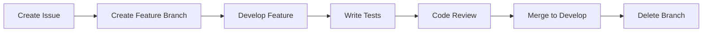
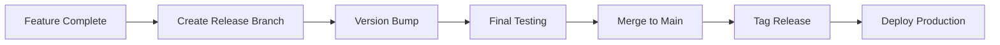
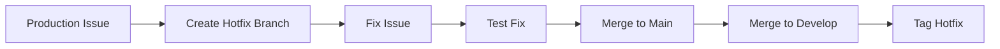

# Git Flow Branching Strategy

## 🌊 Git Flow Overview

The MCP Ecosystem uses Git Flow as its branching strategy to manage feature development, releases, and hotfixes in a structured, scalable way. This document outlines our branching model, workflow processes, and best practices.

## 🏗️ Branch Structure

### Permanent Branches

#### `main` (Production)

- **Purpose**: Production-ready code
- **Protection**: Strictly protected, no direct commits
- **Merges**: Only from release or hotfix branches
- **Tagging**: Version tags applied here
- **Deployment**: Automatic production deployment

#### `develop` (Integration)

- **Purpose**: Integration branch for features
- **Protection**: Protected, requires PR approval
- **Merges**: Feature branches merge here
- **Stability**: Should always be stable and deployable

### Temporary Branches

#### `feature/*` (Feature Development)

- **Naming**: `feature/description-of-feature`
- **Source**: Branch from `develop`
- **Target**: Merge back to `develop`
- **Lifetime**: Until feature is complete
- **Example**: `feature/user-authentication-oauth2`

#### `release/*` (Release Preparation)

- **Naming**: `release/v1.2.3`
- **Source**: Branch from `develop`
- **Target**: Merge to `main` and `develop`
- **Purpose**: Final testing and release preparation
- **Version**: Version bump happens here

#### `hotfix/*` (Production Fixes)

- **Naming**: `hotfix/critical-security-fix`
- **Source**: Branch from `main`
- **Target**: Merge to `main` and `develop`
- **Purpose**: Emergency fixes for production issues
- **Urgency**: Highest priority, bypasses normal flow

## 🔄 Workflow Process

### Feature Development Workflow



#### Step-by-Step Process

1. **Create Issue**

   ```bash
   gh issue create --title "Feature: Add user authentication" \
     --body "Implement OAuth2 authentication system"
   ```

2. **Create Feature Branch**

   ```bash
   # Using the git workflow script
   ./tools/scripts/git-workflow.sh branch "Add user authentication"

   # Or manually
   git checkout develop
   git pull origin develop
   git checkout -b feature/add-user-authentication
   ```

3. **Develop Feature**
   - Write code following our standards
   - Add comprehensive tests
   - Update documentation
   - Commit regularly with clear messages

4. **Quality Assurance**

   ```bash
   # Run all quality checks
   npm run docs:check
   npm run coverage:check
   npm run lint
   ```

5. **Create Pull Request**

   ```bash
   # Using git workflow script
   ./tools/scripts/git-workflow.sh pr "Add user authentication"

   # Or manually via GitHub
   gh pr create --title "feat: add user authentication" \
     --body "Implements OAuth2 authentication system

   ## Changes
   - Added OAuth2 client configuration
   - Implemented JWT token handling
   - Added user session management

   ## Testing
   - Unit tests: ✅
   - Integration tests: ✅
   - Documentation: ✅"
   ```

6. **Code Review & Merge**
   - Automated checks must pass
   - Peer review required
   - Squash merge to develop
   - Delete feature branch

### Release Workflow



#### Release Process

1. **Prepare Release**

   ```bash
   # Create release branch
   git checkout develop
   git pull origin develop
   git checkout -b release/v1.2.3

   # Update version
   npm version patch  # or minor/major
   ```

2. **Final Testing**

   ```bash
   # Comprehensive testing
   npm run test:ci
   npm run coverage:check -- --threshold 90
   npm run docs:check
   ```

3. **Release to Production**

   ```bash
   # Merge to main
   git checkout main
   git merge release/v1.2.3

   # Tag release
   git tag -a v1.2.3 -m "Release v1.2.3"
   git push origin main --tags

   # Merge back to develop
   git checkout develop
   git merge release/v1.2.3

   # Clean up
   git branch -d release/v1.2.3
   ```

### Hotfix Workflow



#### Hotfix Process

1. **Emergency Fix**

   ```bash
   # Create hotfix branch from main
   git checkout main
   git pull origin main
   git checkout -b hotfix/critical-security-patch
   ```

2. **Implement Fix**
   - Minimal changes only
   - Add regression tests
   - Update documentation if needed

3. **Deploy Fix**

   ```bash
   # Merge to main
   git checkout main
   git merge hotfix/critical-security-patch
   git tag -a v1.2.4 -m "Hotfix: Security patch"
   git push origin main --tags

   # Merge to develop
   git checkout develop
   git merge hotfix/critical-security-patch

   # Clean up
   git branch -d hotfix/critical-security-patch
   ```

## 📝 Commit Message Standards

### Conventional Commits Format

All commits must follow the conventional commits specification:

```
<type>[optional scope]: <description>

[optional body]

[optional footer(s)]
```

### Commit Types

| Type       | Description              | Release Impact     |
| ---------- | ------------------------ | ------------------ |
| `feat`     | New feature              | Minor version bump |
| `fix`      | Bug fix                  | Patch version bump |
| `docs`     | Documentation changes    | No version bump    |
| `style`    | Code style changes       | No version bump    |
| `refactor` | Code refactoring         | No version bump    |
| `test`     | Test additions/changes   | No version bump    |
| `chore`    | Maintenance tasks        | No version bump    |
| `perf`     | Performance improvements | Patch version bump |
| `ci`       | CI/CD changes            | No version bump    |
| `build`    | Build system changes     | No version bump    |

### Examples

```bash
# Feature commit
feat(auth): implement OAuth2 authentication flow

- Add Google OAuth2 client configuration
- Implement JWT token generation and validation
- Add user session management

Closes #123

# Bug fix commit
fix(api): resolve memory leak in request handler

The request handler was not properly cleaning up event listeners,
causing memory usage to grow over time.

# Documentation commit
docs(api): update authentication endpoint documentation

- Add missing parameters documentation
- Include error response examples
- Update code samples for v2 API
```

## 🛡️ Branch Protection Rules

### Main Branch Protection

```json
{
  "required_status_checks": {
    "strict": true,
    "contexts": ["test", "lint", "coverage", "docs-check", "security-scan"]
  },
  "enforce_admins": false,
  "required_pull_requests": {
    "required_approving_review_count": 2,
    "dismiss_stale_reviews": true,
    "require_code_owner_reviews": true,
    "dismissal_restrictions": {}
  },
  "restrictions": null
}
```

### Develop Branch Protection

```json
{
  "required_status_checks": {
    "strict": false,
    "contexts": ["test", "lint", "docs-check"]
  },
  "required_pull_requests": {
    "required_approving_review_count": 1,
    "dismiss_stale_reviews": true
  }
}
```

## 🛠️ Automation Tools

### Git Workflow Script

The project includes automated Git workflow tools:

```bash
# Create feature branch
./tools/scripts/git-workflow.sh branch "feature description"

# Create pull request
./tools/scripts/git-workflow.sh pr "feature description"

# Clean up merged branches
./tools/scripts/git-workflow.sh cleanup
```

### Git Hooks

Pre-commit hooks ensure quality:

- **pre-commit**: Linting, formatting, sensitive data checks
- **commit-msg**: Conventional commit validation
- **pre-push**: Test execution and coverage validation

### CI/CD Integration

GitHub Actions workflows:

- **Pull Request Checks**: Automated testing and validation
- **Branch Protection**: Enforced quality gates
- **Release Automation**: Automated versioning and deployment
- **Documentation Sync**: Auto-sync docs with code changes

## 📊 Branch Management

### Branch Naming Conventions

```bash
# Features
feature/add-user-authentication
feature/implement-payment-system
feature/optimize-database-queries

# Releases
release/v1.2.3
release/v2.0.0

# Hotfixes
hotfix/security-patch-2025-001
hotfix/database-connection-fix

# Support branches (rare)
support/legacy-api-v1
```

### Branch Lifecycle Management

#### Creation Rules

- Always branch from the correct source branch
- Use descriptive, hyphen-separated names
- Include issue/ticket numbers when applicable

#### Maintenance Rules

- Delete merged branches immediately
- Keep release branches until confirmed in production
- Archive hotfix branches for audit purposes

#### Cleanup Automation

```bash
# Weekly cleanup script
./tools/scripts/git-workflow.sh cleanup --merged --older-than 7days
```

## 🔍 Monitoring & Metrics

### Branch Health Metrics

- **Active Branches**: Number of open feature branches
- **Merge Frequency**: Average time to merge features
- **PR Review Time**: Average time for code review
- **Branch Age**: Age of oldest active branches

### Quality Metrics

- **Test Coverage**: Coverage percentage by branch
- **Code Quality**: Linting and formatting compliance
- **Documentation**: Documentation completeness
- **Security**: Security scan results

### Reporting

Weekly branch health reports:

```bash
# Generate branch report
./tools/scripts/git-workflow.sh report --weekly
```

## 🚨 Emergency Procedures

### Branch Corruption Recovery

1. **Assess Damage**: Determine scope of corruption
2. **Create Backup**: Preserve current state
3. **Reset from Source**: Reset to last known good state
4. **Reapply Changes**: Cherry-pick valid commits
5. **Validate**: Run full test suite

### Hotfix Priority Protocol

1. **Critical Issues**: Immediate hotfix branch creation
2. **Security Issues**: Coordinate with security team
3. **Data Loss**: Involve database administrators
4. **Service Outage**: Follow incident response plan

## 📚 Training & Adoption

### Git Flow Training

Required training for all team members:

- **Basic Git Flow**: Branch creation and merging
- **Advanced Workflows**: Release and hotfix processes
- **Tool Usage**: Git workflow scripts and automation
- **Troubleshooting**: Common issues and resolutions

### Certification Levels

- **Level 1**: Basic branching and merging
- **Level 2**: Release management and hotfixes
- **Level 3**: Branch strategy design and optimization

## 📞 Support & Resources

### Getting Help

- **Git Flow Guide**: This document
- **Git Workflow Script**: `./tools/scripts/git-workflow.sh --help`
- **Team Chat**: #git-workflow channel
- **Code Reviews**: Peer review for complex merges

### Related Documentation

- **[Commit Message Standards](COMMIT_MESSAGE_GUIDE.md)**
- **[Code Review Guidelines](CODE_REVIEW_GUIDE.md)**
- **[Release Process](RELEASE_PROCESS.md)**
- **[CI/CD Pipeline](CI_CD_GUIDE.md)**

---

**Strategy Version**: 1.0.0
**Last Updated**: 2025-10-29
**Next Review**: 2025-11-29
**Git Flow Master**: Development Team
